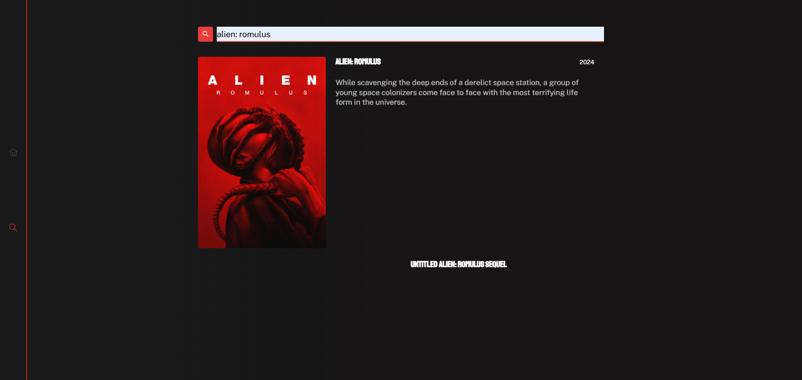

# 🎬 MoviesVortex

**MoviesVortex** is a modern, responsive web application built with **React**, **TypeScript**, and **Chakra UI**. It allows users to search for movies, view detailed information, and explore trending titles using data from the [TMDB API](https://www.themoviedb.org/).

🔗 [Live Demo MoviesVortex](https://moviesvortex.netlify.app/)  
🔗 [GitHub Repository](https://github.com/Giperion317/the-movie-ts)

---

## 🚀 Features

- 🔍 **Search Functionality**: Find movies by title with real-time suggestions.
- 📄 **Detailed Movie Information**: View posters, overviews, ratings, release dates, genres, and cast.
- 🌟 **Trending Movies**: Explore popular and trending movies.
- 🎨 **Responsive Design**: Optimized for both desktop and mobile devices.
- ⚡ **Fast Performance**: Efficient data fetching and state management.

---

## 🛠️ Tech Stack

- **Frontend**: [React](https://reactjs.org/), [TypeScript](https://www.typescriptlang.org/), [Chakra UI](https://chakra-ui.com/)
- **Routing**: [React Router](https://reactrouter.com/)
- **HTTP Client**: [Axios](https://axios-http.com/)
- **API**: [TMDB API](https://www.themoviedb.org/documentation/api)

---

## 📸 Screenshots

| Dark Theme                           | Filter Example                              |
| ------------------------------------ | ------------------------------------------- |
|  |  |

---

## 📦 Installation

1. **Clone the repository**:

   ````bash
   git clone https://github.com/Giperion317/the-movie-ts.git
   cd the-movie-ts
   npm install

   Create a .env file in the root directory and add your TMDB API key:
   REACT_APP_TMDB_API_KEY=your_tmdb_api_key

   ```bash
   npm start
   ````

---

## 🧩 Future Enhancements

- 🗂️ Favorites: Allow users to save favorite movies.
- 🌐 Internationalization: Support multiple languages.
- 🧠 Recommendations: Suggest movies based on user preferences.
- 🔍 Advanced Filters: Filter movies by genre, rating, and release date.

---

## 📄 License

This project is licensed under the MIT License.

---

## 👨‍💻 Author

Anatolii Pysmennyi — **[GitHub](https://github.com/Giperion317)** | **[LinkedIn](www.linkedin.com/in/anatolii-pysmennyi)**
